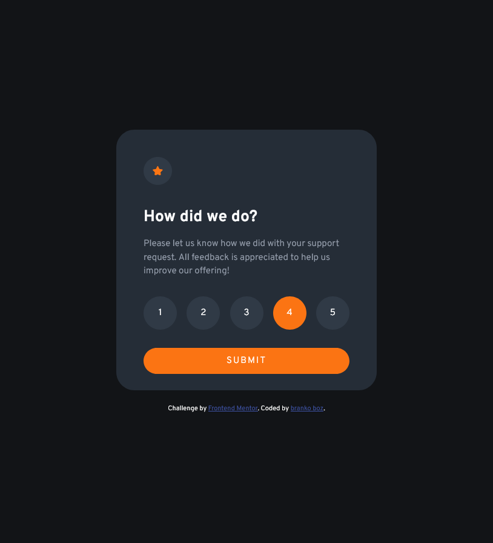
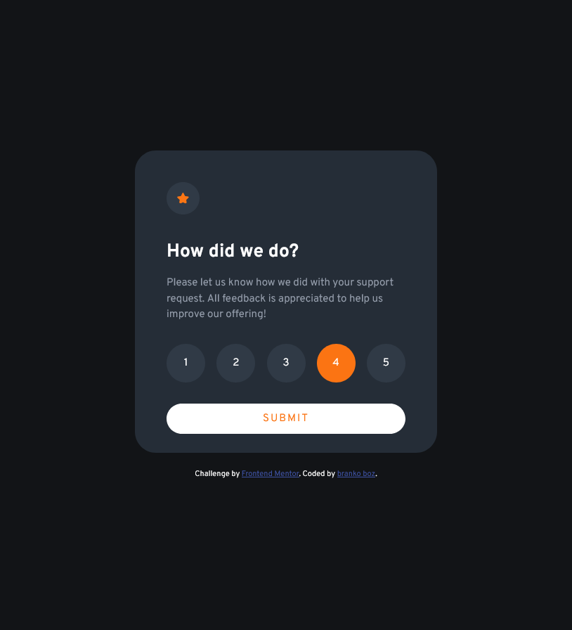
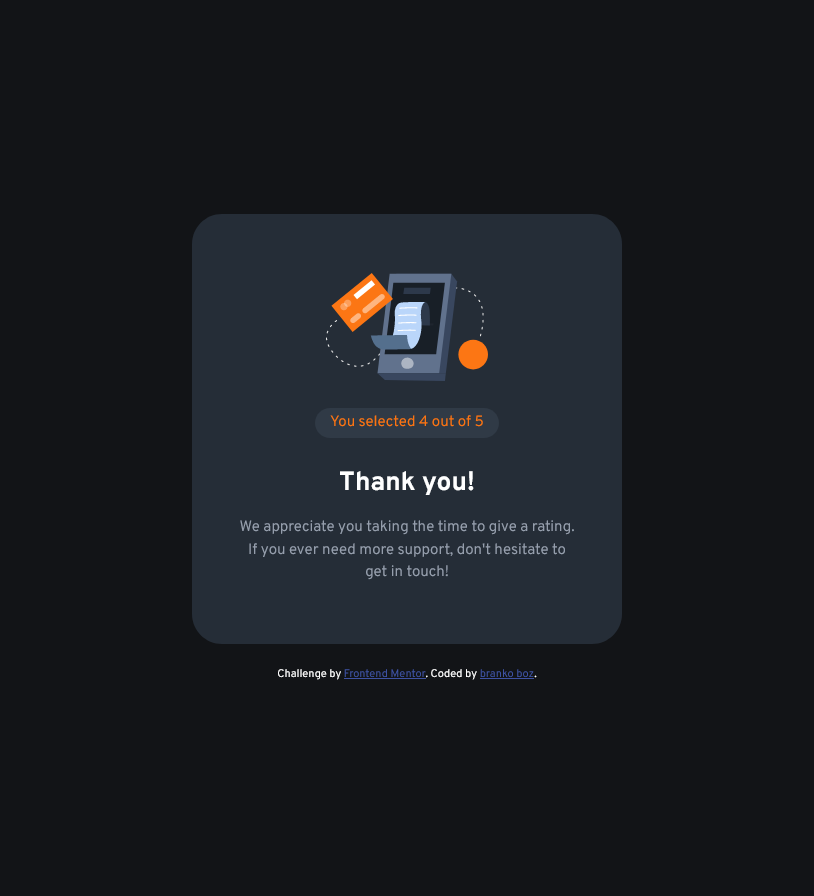

# Frontend Mentor Challenge - Interactive rating component

Solution to the [Frontend Mentor challenge](https://www.frontendmentor.io/challenges/interactive-rating-component-koxpeBUmI).

## The Challenge

Challenge is to build out interactive rating component and get it looking as close to the design as possible. Is a nice, small project to practice handling user interactions and updating the DOM.

## Links

- [Code](https://github.com/brankobozo/interactive-rating-component)
- [live](https://brankobozo.github.io/interactive-rating-component/)

## Screenshot

## Tools

- Semantic HTML5 markup
- SCSS
- Flexbox
- JS
